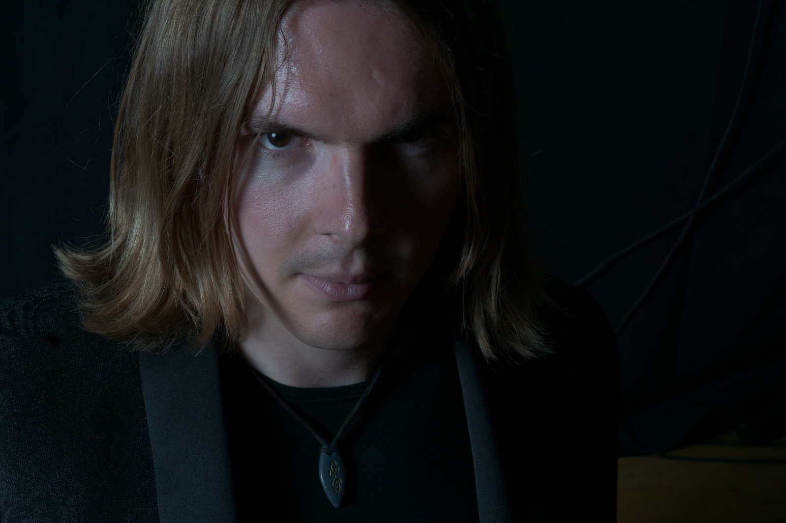
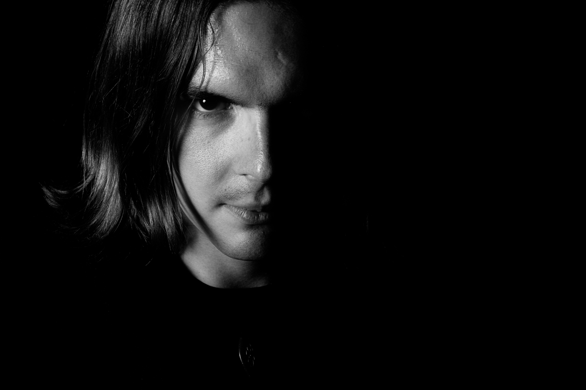

How much processing do you do? 

Do you abandon a photo without trying to process it? 

Here is an example. 

This was taken as an afterthought at the end of the shoot, and the original did not jump out at me during the initial review.

But there was a very nice catch-light in his right eye, so I decided to give it a go.

Turned out quite nice I think.